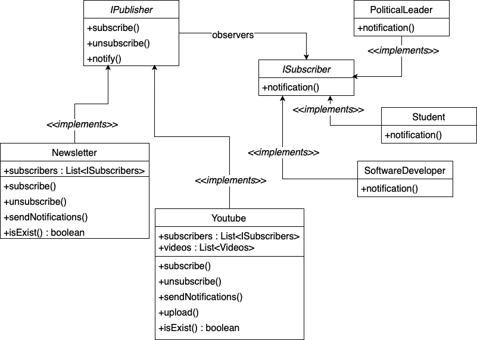

# Observer Pattern examples using Test Driven Development

## Example-1 (NewsLetter):

* There is a newsletter publisher, who has one to many relationships with readers.
* Whenever a new arrival of news has happened, then the publisher will send notification to all kinds of subscribers of it.
* Subscribers can freely subscribe or unsubscribe from the newsletter.

 

### code: [NewsLetter](https://github.com/shaikrasheed99/observer-pattern/tree/master/src/main/java/com/tw)

 

## Example-2 (Youtube channel):

* The YouTube channel publisher will send notification to its subscribers whenever a new video is uploaded.
* Subscribers can freely subscribe or unsubscribe from the channel.

 

### code: [Youtube channel](https://github.com/shaikrasheed99/observer-pattern/tree/master/src/main/java/com/tw)

 

## Class Diagram of both examples:

 

